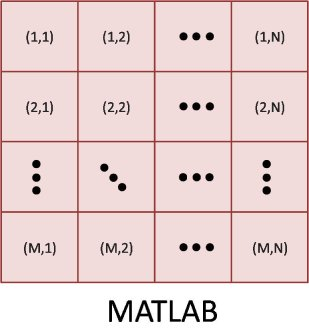
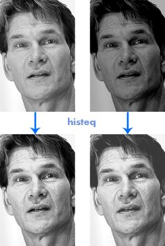

# Face Detection in MATLAB

**A Practical Guide to Face Detection using Gabor Features and Neural Networks**

Face Detection System is an educational MATLAB implementation that demonstrates face detection in grayscale images using Gabor feature extraction and multi-layer feed-forward neural networks. This project was originally developed as a course project in 2006 and serves as a comprehensive guide to understanding the fundamentals of face detection systems.


## Preface

This README documentation is based on content from the comprehensive guidebook "Face Detection in MATLAB: A Practical Guide to Face Detection using Gabor Features and Neural Networks" (Third Edition) written by Omid B. Sakhi and originally published in 2013. The guidebook was written to accompany the Face Detection System codebase and provides detailed, step-by-step explanations of every aspect of the implementation.

The original guidebook tells the story of how this face detection system came to be - starting as a course project in March 2006, when the author was just beginning to learn MATLAB and had no prior experience with pattern recognition or machine learning. What began as a simple idea (using if-else statements and pixel values to detect faces!) evolved into a complete educational system that became an entry point into the world of machine learning for many students.

Unlike theoretical textbooks filled with mathematical formulas, this guide focuses on practical implementation. It explains the Face Detection System line by line, covering everything from basic image processing concepts in MATLAB to advanced topics like Gabor feature extraction and neural network training. The book was designed to be accessible to beginners while providing enough depth for those who want to understand and modify the system.

This README captures the essential content from that guidebook, providing you with:
- Detailed explanations of the underlying concepts
- MATLAB code examples and implementations
- Step-by-step walkthroughs of key functions
- Practical guidance for using and extending the system

Whether you're a student learning about computer vision, a researcher exploring face detection techniques, or a developer implementing similar systems, this documentation aims to provide the same practical, hands-on learning experience that made the original guidebook valuable to so many readers over the years.

---

## Table of Contents

- [Overview](#overview)
- [What is Face Detection?](#what-is-face-detection)
- [Requirements](#requirements)
- [Installation](#installation)
- [Quick Start](#quick-start)
- [Image Processing Fundamentals](#image-processing-fundamentals)
- [Artificial Neural Networks](#artificial-neural-networks)
- [Feature Extraction](#feature-extraction)
- [Face Detection System](#face-detection-system)
- [Training Dataset](#training-dataset)
- [Key Functions Explained](#key-functions-explained)
- [Future Work](#future-work)
- [Author & License](#author--license)

## Overview

This face detection system demonstrates a complete pipeline for detecting faces in grayscale images. The system uses:

- **Gabor Filters** for robust feature extraction (5 scales × 8 orientations = 40 filters)
- **Multi-layer Feed-forward Neural Networks** with backpropagation for classification
- **Pre-selection stage** using template matching for efficient candidate location detection
- **Intelligent search algorithm** that adapts based on neural network confidence
- **Post-processing** with morphological operations for final face localization

The system is designed for educational purposes and processes images with faces that can fit inside a 27×18 pixel window.

## What is Face Detection?

Face detection is the first and foremost step in any automated face recognition and face alignment system. Its reliability greatly affects the performance and usability of the whole system.

Given a single image or a video frame, an ideal face detector should locate all present faces regardless of their position, facial gestures, variations in scale, orientation, illumination, skin color, and background.

Several clues may facilitate the detection process:
- **Skin color** (for faces in colorful images and videos)
- **Motion** (for detecting faces in videos by subtracting video frames)
- **Pattern matching** (for grayscale still images - the hardest case)

The hardest kind of detection is face detection in grey-level still images, in which there is no cue of any type like color or motion. Given an image with several faces inside, the processing is usually done as follows:

1. We have a classifier that has learned how to classify according to its training process over face and non-face examples
2. The input image is scanned at all possible locations and scales by a sub-window (patch)
3. Face detection classifiers determine if the pattern in each sub-window is a face or non-face


## Requirements

- **MATLAB Version**: 7.0 or above (tested on MATLAB 2013a)
- **Required Toolboxes**:
  - Image Processing Toolbox
  - Neural Network Toolbox

**Important Note**: Face Detection System needs MATLAB version 7.0 or above. The version of your MATLAB should have both the Neural Network and Image Processing toolboxes installed.

## Installation

1. Clone or download this repository
2. Copy all files and directories to MATLAB's work folder
3. Navigate to the root folder containing `main.m`
4. Ensure you have the required MATLAB toolboxes installed

## Quick Start

1. **Navigate to the project folder**:
   ```matlab
   cd path/to/face-detection-gabor
   ```

2. **Run the main program**:
   ```matlab
   main
   ```

3. **First-time setup** (automatically performed):
   - Creates Gabor filters and stores them in `./data/gabor.mat`
   - Creates training dataset and stores it in `./data/imgdb.mat`
   - Creates neural network structure and stores it in `./data/net.mat`

4. **Train the network**:
   - Click on "Train Network" in the menu
   - Wait for training to complete

5. **Test on photos**:
   - Click on "Test on Photos"
   - Select a `.jpg` image from the file dialog
   - Wait for face detection to complete
   - Results will be displayed with rectangles around detected faces

**Note**: The program only detects faces that can fit inside a 27×18 pixel window.

## Image Processing Fundamentals

### Digital Image Representation

A digital image is a matrix (a two-dimensional array) of pixels. The value of each pixel is proportional to the intensity of light for the corresponding point in the scene. This value is usually called **intensity value** which is derived from the output of an A/D (Analog-to-Digital) converter.

The matrix of pixels is described as $M \times N$ m-bit where:
- $M$ is the number of rows along the y-axis
- $N$ is the number of columns along the x-axis
- $m$ controls the number of brightness values

If $m$ is $8$, it is said that we have an 8-bit image that gives brightness levels ranging between $0$ and $255$. An 8-bit image is usually the most common used image type in MATLAB. $0$ and $255$ represent black and white, respectively, with shades of grey in between. Since no color is mentioned, this image is also called a **greyscale**, **grey-level** or **monochrome** image.



### Coordinate System

The coordinate system used in MATLAB uses the notation $(r,c)$ to indicate rows and columns. The first element refers to row and the second to a column. The origin of the coordinate system is the top-left pixel of the image. Given an image of size $M \times N$, in MATLAB, $r$ ranges from $1$ to $M$, and $c$ from $1$ to $N$. $(0,0)$ is undefined in MATLAB and causes the program to crash with an "Index exceeds matrix dimensions" error.

To convert a spatial coordinate $(x,y)$ to a pixel coordinate $(r,c)$:
\[
p(r,c) = p(rows - y, x)
\]

### Reading and Displaying Images

**Reading images**:
```matlab
img = imread('filename');
```

Supported formats: BMP, GIF, ICO, JPEG, JPEG2000, PBM, PCX, PGM, PNG, PPM, TIFF, XWD

**Getting image size**:
```matlab
[M, N] = size(img);
M = size(img, 1);  % number of rows
N = size(img, 2);  % number of columns
```

**Displaying images**:
```matlab
imshow(img);              % default: [0 255]
imshow(img, [low high]);  % specify range
imshow(img, []);          % auto-scale (useful for floating point images)
```

**Writing images**:
```matlab
imwrite(img, 'filename.png');
imwrite(img, 'filename', 'png');
```

### Data Types

MATLAB supports various data types for images:

- `uint8`: 8 bits, unsigned char (0-255)
- `int8`: 8 bits, signed char
- `uint16`: 16 bits, unsigned short integer
- `int16`: 16 bits, signed short integer
- `int32`: 32 bits, signed int
- `single`: 32 bits, floating point
- `double`: 64 bits, double precision floating point

**Converting between types**:
```matlab
img_uint8 = im2uint8(img);      % Convert to uint8
img_gray = mat2gray(img);       % Convert to [0,1] range
img_gray = mat2gray(img, [low, high]);  % Specify range
```

**Example of im2uint8**:
```matlab
f = [-0.75  1.75;
      0.50  0.00];
im2uint8(f)
% Result:
%     0   255
%   128     0
```

### Array Indexing

MATLAB provides powerful indexing schemes:

**Vector indexing**:
```matla
v = [1 3 5 7 9];
v(2)           % Returns 3
v(1:3)         % Returns [1 3 5]
v(2:4) = 0     % Sets elements 2-4 to 0
```

**Matrix indexing**:
```matlab
A = [1 2 3; 4 5 6; 7 8 9];
A(3,2)         % Returns 8 (row 3, column 2)
A(2,:)         % Returns entire second row
A(:,[2 4])     % Returns columns 2 and 4
A([1 3],[2 4]) % Returns specific elements
```

**Colon operator**:
```matlab
4:7            % Returns [4 5 6 7]
A(1:4, [2 4])  % Selects rows 1-4, columns 2 and 4
A(:, [2 4])    % All rows, columns 2 and 4
```

### Useful Functions

**Reshape**:
```matlab
out = reshape(in, m, n);  % Changes dimensions, preserves elements column-wise
```

**Flip operations**:
```matlab
B = flipud(B);  % Flips matrix upside down
B = fliplr(B);  % Flips matrix left to right
```

**Loops**:
```matlab
for variable = initval:endval
    % statements
    break;      % Exit loop
    continue;   % Skip to next iteration
end
```

## Artificial Neural Networks

### A Perceptron Neuron

A perceptron is the simplest form of neural network, invented in 1957 by Frank Rosenblatt. It can be seen as a binary classifier which maps its input vector $x$ to a single binary output value $f(x)$:

\[
f(x) = \left\{
\begin{array}{ll}
1 & \mbox{if } w \cdot x + b > 0 \\
0 & \mbox{otherwise}
\end{array}
\right.
\]

where:
- $w$ is a vector of weights (real values)
- $w \cdot x$ is the dot product of the input vector by the weight vector
- $b$ is called **bias** - a constant term that does not depend on any input value


**How it works**:
1. **Training phase**: Teach the neuron how to react when it sees input patterns. During learning, weights $w$ and bias $b$ change.
2. **Testing phase**: Give any input pattern (even unseen ones), and it returns a value based on what it learned.

### Single Layer Perceptron

A single layer perceptron network consists of multiple perceptron neurons arranged in a layer. Each neuron is connected to all inputs through weights $w_{i,j}$, where $i$ indicates the neuron and $j$ indicates the input.


In the compactified vector model:
- $R$ is the number of elements in the input vector
- $S$ is the number of neurons in the layer
- Weights form a matrix instead of a single vector
- Bias becomes a vector of size $S$

The **hardlim** function used in perceptrons is a step function.

### Multi-layer Feed-Forward Network

A multi-layer feed-forward network is a series of several layers (usually two) of single-layer perceptron networks. The term **feed-forward** means no output of any neuron goes to previous layers as input (unlike Recurrent Neural Networks which have feedback).


**Training**: The most popular training method is **backpropagation**, where errors propagate backwards from output neurons to input neurons during training.

### Creating The Network

#### The Easy Way

A multi-layer feed-forward neural network can be created with `newff`:

```matlab
net = newff(P, T, [S1 S2...]);
```

where:
- $P$ is an $R \times Q$ matrix of $Q$ input vectors (each with $R$ elements)
- $T$ is a $S \times Q$ matrix of $Q$ target vectors (each with $S$ elements)
- $S1$ is the number of neurons in the first layer (input layer)
- $S2$ is the number of neurons in the second layer (output layer)
- Any layers in between are called **hidden layers**

**Example**:
```matlab
net = newff(P, T, [10 1]);  % 10 neurons in input layer, 1 in output layer
```

**For face detection**: Since we want to distinguish between faces and non-faces, only one neuron in the output layer is sufficient.

#### Inputs and Outputs Explained

**Important distinction**:
- Small $p$: A single pattern (vertical vector) to be tested
- Capital $P$: A set of patterns (matrix) for training
- Small $t$: Target for a single pattern
- Capital $T$: Targets for all training patterns

**Key points**:
- The input of a neural network is always a **vector**
- If you have an image patch, you must either:
  - Reshape it to a vector, OR
  - Extract features and form a feature vector

**Example**: Consider 30 face patches and 40 non-face patches, each $27 \times 18$:
1. Reshape each patch to a vector of size $486 \times 1$ ($486 = 27 \times 18$)
2. Concatenate all vectors to form $P$ matrix: $486 \times 70$
3. Create $T$ vector: $1 \times 70$ with 0.9 for faces and -0.9 for non-faces

**Note**: This example uses intensity values directly. In practice, we use features (Gabor features) instead for robustness to illumination variations.

#### Transfer Functions

Common transfer functions used in neural networks:


- **hardlim** (Hard Limit): Maps input to 0 or 1 - very restrictive
- **logsig** (Logarithm Sigmoid): Outputs values between 0 and 1
- **tansig** (Hyperbolic Tangent Sigmoid): Outputs values between -1 and 1
- **purelin** (Pure Linear): Usually for regression problems, can go to infinity

**Why not use hardlim?**: It doesn't indicate how close we are to the target. If the network returns 0 for a face, we don't know if it's very confident or just barely missed.

**Setting transfer functions**:
```matlab
net = newff(P, T, [20 1], {'logsig', 'tansig'});
% 20 neurons with logsig, 1 output neuron with tansig
```

**Target values**: Should match the transfer function:
- For `tansig` output: Use -0.9 for non-face, 0.9 for face
- For `logsig` output: Use 0.1 for non-face, 0.9 for face

**Classification strategies**:
1. **Single output neuron**: Sign determines class, values near zero are ambiguous
2. **Multiple output neurons**: One per class, check consistency

In the face detection program, we use **one output neuron with `tansig` transfer function**.

#### Weight Initialization

Initialize weights and biases to random values:

```matlab
net = init(net);
```

This randomizes weights and biases for all layers.

#### Creating The Network: The Hard Way

The face detection system uses a more flexible approach by defining the network structure manually:

```matlab
net = network;              % Create empty network
net.numInputs = 1;          % One input layer
net.numLayers = 2;          % Two layers total
net.biasConnect = [1;1];    % Both layers have bias
net.inputConnect = [1;0];   % Input connects only to first layer
net.layerConnect = [0 0;    % No feedback connections
                    1 0];
net.outputConnect = [0 1]; % Output from second layer
net.targetConnect = [0 1];  % Target on second layer

% Input range: [-1, 1] for 2160 features
netInputs = ones(2160, 2);
netInputs(1:2160, 1) = -1;
net.inputs{1}.range = netInputs;

% Layer sizes
net.layers{1}.size = 100;   % 100 neurons in hidden layer
net.layers{2}.size = 1;     % 1 neuron in output layer

% Transfer functions
net.layers{1:2}.transferFcn = 'tansig';

% Initialization
net.layers{1:2}.initFcn = 'initnw';  % Nguyen-Widrow initialization
net.initFcn = 'initlay';

% Training and performance functions
net.performFcn = 'msereg';  % Mean Squared Error with Regularization
net.trainFcn = 'trainscg';  % Scaled Conjugate Gradient Backpropagation
```

### Training The Network

Training adjusts weights and biases iteratively:

```matlab
net = train(net, P, T);
```

**Training parameters** (set in `trainnet.m`):

```matlab
net.trainFcn = 'trainscg';       % Scaled Conjugate Gradient (fast, memory-efficient)
net.trainParam.lr = 0.4;          % Learning rate
net.trainParam.epochs = 400;      % Maximum iterations
net.trainParam.show = 10;        % Display update frequency
net.trainParam.goal = 1e-3;      % Performance goal
```

**Training methods**:
- `trainscg`: Scaled Conjugate Gradient - best for this application (fast, low memory)
- Other options: Levenberg Marquardt (faster but more memory), etc.

**Performance functions**:
- `msereg`: Mean Squared Error with Regularization (used in this system)
- `mse`: Mean Squared Error
- `mae`: Mean Absolute Error

**Important**: The objective function looks like a "pumice" in hyper-dimension - very rough with lots of highs and lows. Converging to the global minimum is not guaranteed.

### Testing and Simulation

After training, use the network for classification:

```matlab
a = sim(net, p);  % Single pattern
a = sim(net, P);  % Multiple patterns
```

**Output dimensions**:
- One pattern, one output neuron: $1 \times 1$ (scalar)
- $M$ patterns, one output neuron: $1 \times M$
- $M$ patterns, $N$ output neurons: $N \times M$

**Key difference**: Once trained, weights are fixed. Unlike our brain, there's no ongoing learning - the network uses what it learned during training.

### Computing The Error

**Mean Squared Error (MSE)**:
\[
MSE = \frac{1}{N_p} \sum_{i=1}^{N_p} \left(O_i^a - O_i^d \right)^2
\]

where:
- $N_p$ is the number of patterns
- $O_i^a$ is the actual output for pattern $i$
- $O_i^d$ is the desired output for pattern $i$

**Mean Absolute Error (MAE)**:
\[
MAE = \frac{1}{N_p} \sum_{i=1}^{N_p} |O_i^a - O_i^d|
\]

**Maximum Absolute Error (MaAE)**:
\[
MaAE = \max |O_i^a - O_i^d|, \quad i=1,...,N_p
\]

MaAE is rarely used because it's not derivable and requires stochastic search methods (simulated annealing, genetic algorithms, particle swarm optimization).

## Feature Extraction

The `im2vec.m` function is the most important function in the program. It converts a $27 \times 18$ image patch to a 2160-dimensional feature vector ready for the neural network. This function executes:
1. During training (to generate training dataset)
2. During testing (to classify image patches)

### Gray-level Features

The simplest approach is to reshape the patch directly to a vector:

```matlab
vector = reshape(patch, [486 1]);  % 486 = 27 × 18
```

**Extracting all patches from a test image**:
```matlab
[m, n] = size(test_image);
for y = 1:m
    for x = 1:n
        try
            patch = test_image(y-13:y+13, x-9:x+8);  % 27×18 patch centered at (x,y)
        catch
            continue;  % Skip if patch goes outside image boundaries
        end
        % Process patch...
    end
end
```

**Problem**: Direct intensity values are sensitive to variations in contrast and brightness.

The transformation:
\[
p_{new} = a \times p_{old} + b
\]

where $a$ controls contrast and $b$ controls brightness. Our brain ignores these variations, but neural networks see them as different images.


### Histogram Equalization

To neutralize effects of contrast and brightness, use histogram equalization:

```matlab
newpatch = histeq(patch);
```

This enhances contrast by transforming intensity values so the output histogram approximately matches a specified histogram. If no histogram is specified, it uses 64 bins by default.



### Different Lighting Conditions

Changing contrast/brightness simulates illumination changes, but when the light source moves physically, we have a non-linear problem.


**Solutions**:

1. **Background Illumination Model**: Filter image with large Gaussian kernel, then subtract to remove background illumination effects.

2. **Adaptive Histogram Equalization** (used in this system):
```matlab
newpatch = adapthisteq(patch, 'Numtiles', [8 3]);
```

This computes histogram equalization locally (within $8 \times 3$ tiles) instead of globally, making it adaptive to local lighting variations. The tile size was found by trial and error.

### Normalization

Each input vector should be normalized to a pre-defined range. The most popular range is $[-1, 1]$, which has symmetry around zero and helps with training, especially with uniform initialization.

### Gabor Feature Extraction

Gabor features are the coefficients of the response of Gabor filters. Gabor filters are related to Gabor wavelets.

**Gabor Wavelets**: Each Gabor wavelet is formed from two components:
- A complex sinusoidal carrier
- A Gaussian envelope

The sinusoidal carrier has a frequency and orientation, similar to the human visual system (visual cortex). Gabor filtering is appropriate for discrimination and representation of texture images.


**Real Gabor Wavelet Implementation**:
```matlab
function kernel = gabor(t, l, g, psi)
% t (theta): orientation, 0 <= t <= pi
% l (lambda): wavelength
% g (gamma): 0 < g <= 1
% psi: phase, 0 <= psi <= 2*pi
s = l/3.5;  % sigma
filtersize = floor(l/g);
[y, x] = ndgrid(-filtersize:filtersize, -filtersize:filtersize);
ty = x*cos(t) + y*sin(t);
tx = -x*sin(t) + y*cos(t);
kernel = exp(-0.5*(g^2*ty.^2 + tx.^2)/s^2);
kernel = kernel.*cos((2*pi/l)*tx + psi);
```

**Parameters**:
- Frequency is inversely related to $\lambda$ (lambda)
- Any created kernel has odd number of rows and columns

### Why Gabor Features?

When input data is too large and/or redundant, we transform it into a reduced representation called **features**. This process is **feature extraction**.

**For face detection**: We want to highlight parts common to all faces (eyes, lips, nose, hair). Gabor features can:
- Highlight common facial features
- Remove useless and redundant information
- Be used for both face detection and face recognition

Looking at Gabor filtering results on a face, you can identify locations of eyes, nose, and mouth.

### How To Perform Gabor Filtering?

Gabor filtering is done by **convolving** images with Gabor kernels:

\[
f \ast g
\]

**Visual understanding**: Place kernel on top of image, multiply corresponding pixels, sum into scalar value, place at center. Move kernel one pixel and repeat.

### Fast Gabor Filtering

Convolutions can be computed faster using **Fast Fourier Transform (FFT)**:

1. Transform each Gabor kernel to frequency domain using FFT (compute once, store)
2. Transform image patch to frequency domain using FFT
3. Multiply them pixel-by-pixel in frequency domain
4. Transform back to spatial domain using Inverse FFT (IFFT)

**Considerations**:
- Patch size: $27 \times 18$
- For FFT, sizes must be same and power of two
- Solution: Zero-pad to $32 \times 32$
- Each Gabor kernel also has size $32 \times 32$
- Result after IFFT: $32 \times 32$, then cropped back to $27 \times 18$

### im2vec.m Detailed Explanation

This is the most important function - converts $27 \times 18$ patch to feature vector:

```matlab
function IMVECTOR = im2vec(W27x18)
```

**Step 1: Load Gabor kernels**
```matlab
loadgabor;  % Loads pre-computed Gabor kernels in frequency domain (stored in G)
```

**Step 2: Adaptive histogram equalization**
```matlab
W27x18 = adapthisteq(W27x18, 'Numtiles', [8 3]);
```

**Step 3: Apply Gabor filters (5 scales × 8 orientations = 40 filters)**
```matlab
Features135x144 = cell(5, 8);
for s = 1:5      % 5 scales
    for j = 1:8  % 8 orientations
        Features135x144{s,j} = mminmax(abs(ifft2(G{s,j} .* fft2(double(W27x18), 32, 32), 27, 18)));
    end
end
```

This computes:
- FFT of patch (zero-padded to 32×32)
- Multiply with Gabor kernel in frequency domain
- IFFT back to spatial domain (cropped to 27×18)
- Take absolute value (since complex Gabor filters produce complex results)
- Normalize to [-1, 1] using `mminmax`

**Step 4: Concatenate all responses**
```matlab
Features45x48 = cell2mat(Features135x144);
```

Result: $135 \times 144$ matrix ($5 \times 27 = 135$, $8 \times 18 = 144$)
- Total elements: $135 \times 144 = 19,440$

**Step 5: Dimensionality reduction**
```matlab
Features45x48(3:3:end, :) = [];  % Remove every 3rd row
Features45x48(2:2:end, :) = [];  % Remove every 2nd row
Features45x48(:, 3:3:end) = [];  % Remove every 3rd column
Features45x48(:, 2:2:end) = [];  % Remove every 2nd column
```

Result: $45 \times 48$ matrix
- Total elements: $45 \times 48 = 2,160$

**Why not use PCA?**: Too slow to compute for each possible window. Simple downsampling is faster.

**Step 6: Reshape to vector**
```matlab
IMVECTOR = reshape(Features45x48, [2160 1]);
```

Final output: $2160 \times 1$ feature vector


## Face Detection System

To complete the system, we need three additional stages: pre-selection, search algorithm, and post-processing.

### Pre-Selection

The initial approach of checking every pixel was too slow (taking hours). Pre-selection uses template matching to identify potential face locations.

**Method**: Cross-correlate template faces with the test image. Cross-correlation is a measure of similarity (like convolution but without rotating the kernel).

**Templates**: Two template faces ($27 \times 18$):
- One with bright background
- One with dark (black) background

**Implementation**:
```matlab
% Normalize images to [-1, 1]
C1 = mminmax(double(im));                    % Test image
C2 = mminmax(double(imread(TEMPLATE1)));     % Template 1
C3 = mminmax(double(imread(TEMPLATE2)));     % Template 2

% Compute correlations
Corr_1 = double(conv2(C1, C2, 'same'));
Corr_2 = double(conv2(C1, C3, 'same'));

% Find regional maxima (peaks)
Cell.state = int8(imregionalmax(Corr_1) | imregionalmax(Corr_2));
```

**Border handling**: Remove peaks near borders (where 27×18 patch wouldn't fit):
```matlab
Cell.state(1:13, :) = -1;           % Top border
Cell.state(end-13:end, :) = -1;    % Bottom border
Cell.state(:, 1:9) = -1;            % Left border
Cell.state(:, end-9:end) = -1;      % Right border
```

**Storage**:
```matlab
Cell.net = ones(m, n) * -1;  % Neural network outputs (initially -1)
```

**Visualization**:
```matlab
[LUTm, LUTn] = find(Cell.state == 1);
figure;
imshow(im);
hold on;
plot(LUTn, LUTm, '.y');  % Yellow dots show candidate locations
drawnow;
```


**Results**: An ideal peak should be at the nose, but there are false positives and occasional false negatives.

### Search Algorithm

The search algorithm checks candidate locations and their neighborhoods. It uses neural network output to intelligently guide the search.

**Strategy**:
- High confidence face → Check nearby pixels
- High confidence non-face → Skip nearby pixels
- Medium confidence → Check but don't expand search

**Implementation**:
```matlab
while (1 == 1)  % Infinite loop
    % Find one pixel with state = 1
    [i, j] = find(Cell.state == 1, 1);
    
    % Stop condition
    if isempty(i)
        break;
    end
    
    % Crop patch
    imcut = im(i-13:i+13, j-9:j+8);
    
    % Mark as checked
    Cell.state(i, j) = -1;
    
    % Classify with neural network
    Cell.net(i, j) = sim(net, im2vec(imcut));
    
    % Decision based on output
    output = Cell.net(i, j);
    
    if output < -0.95
        % Black dot: Definitely not a face
        % Cancel nearby locations (3 city block radius)
        % ... set nearby Cell.state to -1 ...
    elseif output >= -0.95 && output < -0.5
        % Magenta dot: Probably not a face
        % Don't change anything
    elseif output >= -0.5 && output < 0.5
        % Red dot: Uncertain
        % Don't change anything
    elseif output >= 0.5 && output < 0.95
        % Green dot: Probably a face
        % Mark nearby pixels (3 city block) to check
        % ... set nearby Cell.state to 1 (if not already checked) ...
    else  % output >= 0.95
        % Blue dot: Confirmed face
        % Cancel entire 27×18 area (no other face can be here)
        % ... set 27×18 area in Cell.state to -1 ...
    end
end
```

**Color coding**:
- **Black dot**: Output < -0.95 (definitely not a face)
- **Magenta dot**: -0.95 ≤ Output < -0.5
- **Red dot**: -0.5 ≤ Output < 0.5 (uncertain)
- **Green dot**: 0.5 ≤ Output < 0.95 (probably face, check neighbors)
- **Blue dot**: Output ≥ 0.95 (confirmed face)


### Post-Processing

After neural network classification, we need to decide which locations are faces.

**Step 1: Thresholding**
```matlab
Threshold = 0.5;
xy_ = Cell.net > Threshold;
```


**Step 2: Morphological Dilation**
```matlab
xy_ = imdilate(xy_, strel('disk', 2, 4));
```

This connects disconnected regions that belong to the same face, avoiding duplicate detections.


**Step 3: Connected Component Analysis**
```matlab
LabelMatrix = bwlabel(xy_);
CentroidMatrix = regionprops(LabelMatrix, 'centroid');
```

This finds the center of each connected component (each detected face region).


**Step 4: Visualization**
```matlab
for i = 1:nLabel
    xy_(fix(CentroidMatrix(i).Centroid(2)), ...
        fix(CentroidMatrix(i).Centroid(1))) = 1;
end
% Draw rectangles around faces
drawrec(xy_, im);
```


## Training Dataset

### Creating the Dataset

The training dataset consists of:
- **Face images**: Located in `./face/` folder (PNG format, 27×18 pixels)
- **Non-face images**: Located in `./non-face/` folder (PNG format, 27×18 pixels)

**Why 27×18?**: Completely unintentional - found images online with this size and kept it.

**Software for preparation**:
- ~~Windows: Photoshop (recommended) or Microsoft Paint~~
- ~~Linux: GIMP (free)~~
- Use [Photopea](https://www.photopea.com/) (free, web-based, cross-platform)

### Dataset Augmentation

The system automatically augments training data:

**For Face Images** (10 variations per image):
1. Original image
2. Left-right flip (`fliplr`)
3. Circular shift by 1 pixel up (`circshift(image, 1)`)
4. Circular shift by 1 pixel down (`circshift(image, -1)`)
5. Circular shift by 1 pixel right (`circshift(image, [0 1])`)
6. Circular shift by 1 pixel left (`circshift(image, [0 -1])`)
7-10. All shifts applied to flipped image

**For Non-Face Images** (2 variations per image):
1. Original image
2. Left-right flip (`fliplr`)
3. Upside-down flip (`flipud`)

**Additional augmentation ideas**: Rotation, scaling, etc.

### Bootstrap Method for Non-Faces

Finding non-face images is challenging (non-face can be anything). Use bootstrap method:

1. Start with 5-6 random non-face images
2. Train network
3. Test on image without faces
4. Collect false positives (patches with high response like 0.9)
5. Add false positives to non-face folder
6. Retrain and repeat

**Important**: Maintain balance between face and non-face samples. Adding non-face images reduces the effect of face images, and vice versa.

**Challenges**:
- Adding one non-face → may cause false negatives (miss previously detected faces)
- Adding more faces → may cause false positives (detect faces where there aren't any)

### loadimages.m Function

This function reads images and generates the training dataset (IMGDB):

```matlab
function IMGDB = loadimages
```

**Structure**:
```matlab
face_folder = 'face/';
non_face_folder = 'non-face/';
file_ext = '.png';
out_max = 0.9;   % Target for faces
out_min = -0.9;  % Target for non-faces
```

**Load or create IMGDB**:
```matlab
if exist('imgdb.mat', 'file')
    load imgdb;
else
    IMGDB = cell(3, []);  % 3 rows: name, target, feature vector
end
```

**IMGDB structure**:
- Row 1: Image filename (for debugging)
- Row 2: Desired output (0.9 or -0.9)
- Row 3: Feature vector (from `im2vec`)

**Processing face images**:
```matlab
folder_content = dir([face_folder, '*', file_ext]);
nface = size(folder_content, 1);

for k = 1:nface
    string = [face_folder, folder_content(k,1).name];
    image = imread(string);
    
    % Check size
    [m, n] = size(image);
    if (m ~= 27 || n ~= 18)
        continue;
    end
    
    % Check if already loaded
    f = 0;
    for i = 1:length(IMGDB)
        if strcmp(IMGDB{1,i}, string)
            f = 1;
        end
    end
    if f == 1
        continue;
    end
    
    % Generate 10 variations
    IM{1} = im2vec(image);
    IM{2} = im2vec(fliplr(image));
    IM{3} = im2vec(circshift(image, 1));
    IM{4} = im2vec(circshift(image, -1));
    IM{5} = im2vec(circshift(image, [0 1]));
    IM{6} = im2vec(circshift(image, [0 -1]));
    IM{7} = im2vec(circshift(fliplr(image), 1));
    IM{8} = im2vec(circshift(fliplr(image), -1));
    IM{9} = im2vec(circshift(fliplr(image), [0 1]));
    IM{10} = im2vec(circshift(fliplr(image), [0 -1]));
    
    % Store in IMGDB
    for i = 1:10
        IMGDB{1, end+1} = string;
        IMGDB{2, end} = out_max;
        IMGDB(3, end) = {IM{i}};
    end
end
```

Similar process for non-face images (with 2 variations instead of 10).

**Storage**: IMGDB is saved to `imgdb.mat` (~15MB) for reuse.

## Key Functions Explained

### Core Functions

- **`main.m`**: Main program entry point with menu system
- **`im2vec.m`**: Converts 27×18 patches to 2160-dimensional feature vectors (most important function)
- **`createGabor.m`**: Generates Gabor filter kernels in frequency domain
- **`createNetwork.m`**: Creates neural network structure
- **`trainNetwork.m`**: Trains the neural network
- **`loadImages.m`**: Loads and prepares training dataset
- **`predict.m`**: Classifies image patches using trained network

### Menu Functions

- **`menuLoadImages.m`**: Creates/loads image database
- **`menuCreateNetwork.m`**: Creates neural network structure
- **`menuTrainNetwork.m`**: Trains the network
- **`menuScanImage.m`**: Scans test images for faces

### Utility Functions

- **`mminmax.m`**: Normalizes values to [-1, 1] range
- **`drawRect.m`**: Draws rectangles around detected faces
- **`fmincg.m`**: Optimization function (if used)
- **`sigmoid.m`**, **`sigmoidGradient.m`**: Activation functions
- **`initWeights.m`**: Weight initialization
- **`netcost.m`**: Network cost function

## Performance Considerations

- **Pre-selection**: Reduces computation by avoiding full-image scanning
- **Search Algorithm**: Intelligent neighborhood exploration based on network confidence
- **FFT-based Convolution**: Fast Gabor filtering using frequency domain operations
- **Feature Reduction**: Downsampling reduces feature vector from 19,440 to 2,160 elements
- **One-time Gabor Generation**: Kernels computed once and stored

## Limitations

- Only detects faces that fit in 27×18 pixel windows
- Designed for grayscale images
- Not optimized for real-time applications
- Performance depends on training dataset quality
- Pre-selection stage is responsible for most errors (may miss important areas)

## Future Work

Potential improvements and extensions:

### Pre-Selection Improvements
- Develop more accurate candidate detection methods
- Or skip pre-selection and use low-computational-cost methods to examine entire image

### Fast Convolutional ANN
- Implement neural networks with convolutions
- Every computation can be done using convolutions and FFT

### Feature Selection
- Examine which features are better for detection
- Optimize Gabor filter parameters (size, orientation, internal parameters)
- Reduce feature space dimensionality
- Try other feature types (for sign detection, OCR, etc.)

### Classification Methods
- **SVM** (Support Vector Machines)
- **LDA** (Linear Discriminant Analysis)
- **Naive Bayes**
- **Hidden Markov Models (HMM)**
- Other neural network architectures

### Other Methods
- **Viola-Jones Method**: One of the most popular and fastest real-time face detection methods
- Multi-scale detection
- Real-time processing for video/webcam

For more advanced face detection methods, consider studying the Viola-Jones algorithm, which is one of the most popular real-time face detection methods.

## References

- MATLAB Neural Network Toolbox Documentation
- MATLAB Image Processing Toolbox Documentation
- Gabor Filter Theory and Applications
- Face Detection Literature
- Viola-Jones Face Detection Method
- Backpropagation Algorithm
- Feature Extraction Techniques

## Author & License

**Author**: Omid B. Sakhi

**MATLAB File Exchange**: [Face Detection System](http://www.mathworks.com/matlabcentral/fileexchange/11073-face-detection-system)

**License**: See LICENSE file

**Copyright**: ©2013, Omid B. Sakhi, All Rights Reserved

---

## Getting Help

If you encounter issues:

1. Ensure you're in the correct directory (containing `main.m`)
2. Verify MATLAB version is 7.0 or above
3. Check that Image Processing and Neural Network toolboxes are installed
4. Ensure training images are in `./face/` and `./non-face/` folders (27×18 PNG format)

For questions or support, visit the project website or MATLAB File Exchange page.

---

**Note**: This is an educational implementation. For production applications, consider more advanced methods optimized for real-world scenarios.
